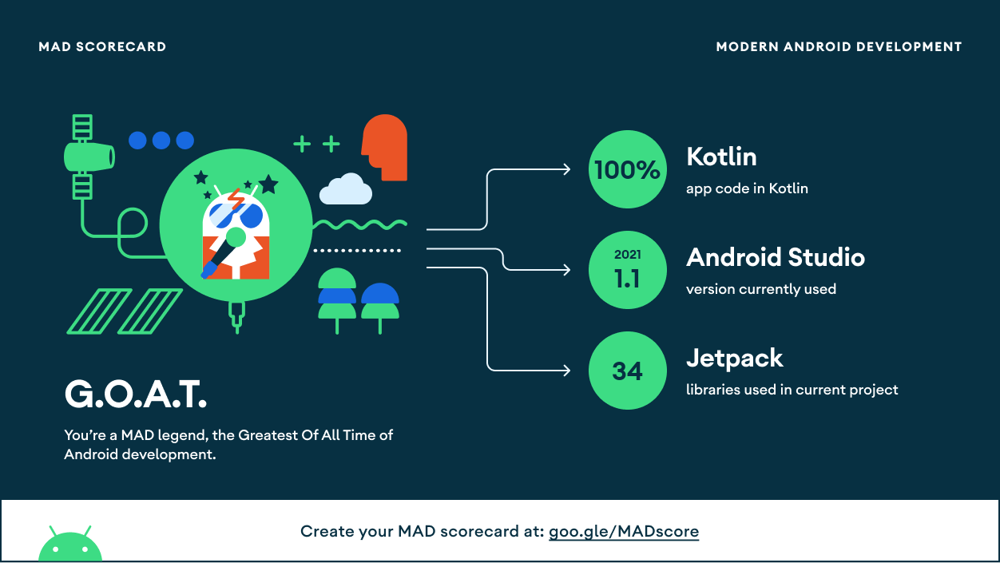
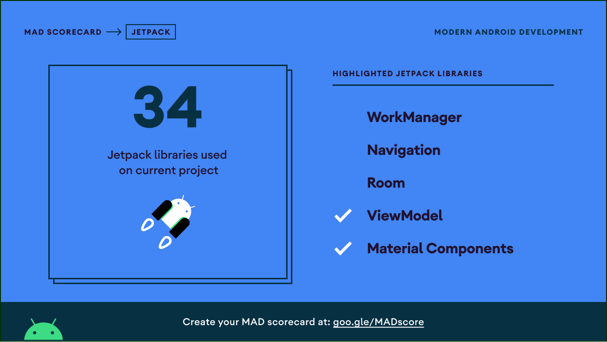

## MVVM Demo using a GitHub API

**Update the following buildconfig fields in [build.gradle](app/build.gradle) to customize the
Repository ID and User ID**

- buildConfigField "String", "USER_ID", '"ArunYogeshwaran"'
- buildConfigField "String", "REPO_ID", '"GitHub-Client"'

## Stacks

**This demo features**

- Gets the closed pull requests corresponding to a User ID and Repository ID specified in
  BuildConfigField in build.gradle
- Shows empty state when there are no closed pull requests
- Shows error state when pull requests couldn't be fetched due to some reason
- Supports pull to refresh to update the list

## Stacks

#### Foundation

- [Coroutines](https://developer.android.com/kotlin/coroutines) - Performing asynchronous code with
  sequential manner.
- [Hilt](https://developer.android.com/training/dependency-injection/hilt-android) - The DI
  framework w/ Jetpack integration.
- [Flow](https://developer.android.com/kotlin/flow) - Reactive streams.
- [Fragment](https://developer.android.com/guide/fragments) - The UI host.
- [Lifecycle](https://developer.android.com/topic/libraries/architecture/coroutines) - Android's
  component lifecycle teams up with coroutines.
- [View Binding](https://developer.android.com/topic/libraries/view-binding) - Providing safe access
  to view.
- [ViewModel](https://developer.android.com/topic/libraries/architecture/viewmodel) - Presenter with
  its semi data persistence behavior.

## MAD Scorecard

 
 
 

## Kotlin Highlights

 
 
 

## Jetpack Highlights

 
 
 

## Ideal State

 
 
 

## Empty State

 
 
 

## Error State

 
 
 